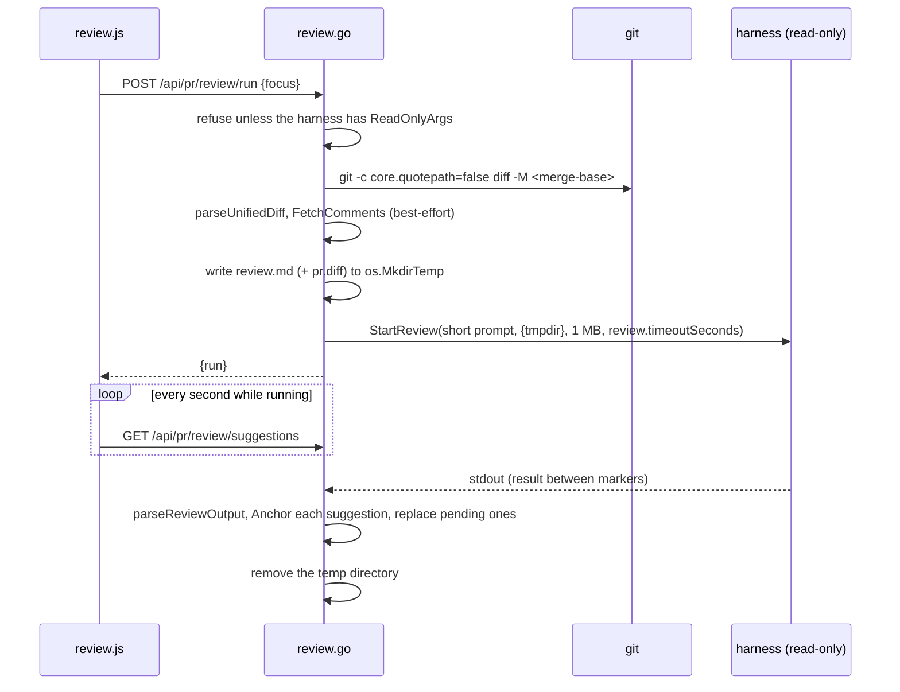

# AI Draft Review

AI review runs a review skill through the coding harness the user selected, read-only, in the PR worktree, and turns what comes back into *suggestions*: drafts with `origin: "ai"` and `status: "pending"` in `prSession.comments`. The reviewer accepts, edits or dismisses each one. Only accepted and edited suggestions are submitted, so no AI text reaches GitHub without a human action on it.

Source: [`review.go`](../../review.go) (run lifecycle, prompt, parsing, HTTP), [`anchor.go`](../../anchor.go) (diff parsing and anchoring), [`agent.go`](../../agent.go) (`StartReview`, read-only argv), [`web/src/review.js`](../../web/src/review.js) (pane, triage, gutter markers). Draft submission is in [github-pr-review.md](github-pr-review.md).

## 1. Run Lifecycle



- One run at a time per PR session (`errReviewRunning`, HTTP 409).
- `startReview` checks the harness before doing any git or network work, so an unsupported harness fails fast.
- `watchReview` polls the agent job every 400 ms and calls `finishReview` once it exits. The run's status becomes `done`, `failed` (harness error or unparseable output; the last 64 KB of output is kept as `raw` for the Retry view) or `cancelled`.
- `finishReview` removes the previous run's **pending** suggestions and appends the new ones. Accepted, edited and dismissed suggestions survive a re-run.
- The temp directory is removed when the run finishes, whatever the outcome.

## 2. Read-Only Enforcement

`StartReview` runs the preset's `ReadOnlyArgs` ([agent-editing.md](agent-editing.md#read-only-argv)): for Claude Code the write tools are disallowed and the temp directory is added with `--add-dir`; for Codex the sandbox is `read-only`. Harnesses without a verified read-only mode, and custom command templates, are refused rather than run with their edit flags. The UI disables **Run AI Review** for them, using `readOnly` from `/api/agent/harnesses`.

The worktree snapshot taken around every harness run is the backstop. If a review run changes a file, the job is `tainted`, the run carries `tainted` and `changed`, and the pane shows a warning. px0 never reverts the change: file writes belong to the harness and the user, per the tenets.

## 3. What the Harness Reads

A single argv element is capped at 32 KB on Windows and 128 KB on Linux, far less than a large PR's diff, so the prompt passed on the command line is one short paragraph (`reviewPrompt`) pointing at `review.md` in the temp directory. `buildReviewDoc` writes, in order:

1. The skill: `review.skillPath`, else `~/.px0/skills/review.md` (next to `settings.json`), else the built-in [`review_skill.md`](../../review_skill.md), embedded with `go:embed`. The built-in skill is a senior-architect review based on [vinaayakh/skills pr-review](https://github.com/vinaayakh/skills/tree/main/skills/pr-review): only the PR's changes and the code they affect, callers and tests read for blast radius, findings in priority order (correctness, contract breaks, security, unoptimized code, maintainability), each one verified by the input that triggers it, one finding per suggestion, and an empty result rather than padding.
2. The optional focus note.
3. PR title, number, URL, author, refs, head SHA and description.
4. The changed files with their status (added, deleted, renamed from, binary).
5. Comments already posted on the PR, so the model does not repeat them.
6. The diff, inlined when it is at most 200 KB. Above that the diff goes to `pr.diff` beside `review.md` and the doc says to read it selectively; the run carries `diffOmitted`.
7. The output format (`reviewOutputFormat`), always appended, so a custom skill cannot change what px0 parses.

## 4. Output Parsing

The harness prints one JSON object between `PX0-REVIEW-BEGIN` and `PX0-REVIEW-END`. `parseReviewOutput` collects every marker-delimited block plus the whole output, and tries them from the last one back, taking the first that decodes into the result shape. Trying from the end matters: some harnesses echo the prompt, and the echoed output format is itself a JSON object between the same markers. Inside a candidate, decoding starts at each `{` in turn, which skips code fences and prose.

Parsing is lenient where models are sloppy: numbers may be strings (`"42"`, `"80%"`), a confidence above 1 is read as a percentage, a missing confidence is 0.5, severities are normalised onto the skill's scale, `critical`, `high`, `medium`, `low` (older names map across: `blocker` → `critical`, `major` → `high`, `minor` → `medium`, `nit` → `low`; anything unknown → `medium`; drafts saved with the older names are mapped when restored), and an approve verdict is recorded as `suggestedApprove` while the verdict that pre-fills the form stays `comment`. A suggestion with neither body nor code is skipped; everything else is kept, sorted by priority (`suggestionLess`): severity, then confidence, then file and line.

## 5. Anchoring

GitHub accepts a review comment only on a line inside one of the PR's hunks, on the side it names: `RIGHT` for added and context lines (new-file numbering), `LEFT` for deleted and context lines (base numbering). `parseUnifiedDiff` reads the whole PR diff into, per file, a map from line number to text for each side plus the hunk each line is in. Hunk ends come from the header's line counts, not from line prefixes, so a blank context line whose leading space was stripped still counts. Renames map the old path to the new one; a deleted file has only `LEFT` lines; binary files are flagged.

`prDiff.Anchor(path, line, startLine, side, quote)`:

1. Resolve the path, tolerating `./`, `a/`, `b/`, a leading `/`, backslashes and the old path of a rename. A file outside the PR becomes a **summary** note.
2. If the line is in a hunk on its side and its trimmed text equals the quote (the quote's last non-blank line, trimmed), keep it: **anchored**. With no quote, being in a hunk is enough.
3. Otherwise search for the quote within 5 lines on the same side. If there are no hits, search the other side (models mix up sides, especially on deleted files). Exactly one hit moves the anchor there: **re-anchored**. Two or more hits on a side are ambiguous and stop the search.
4. Anything else becomes **file**-level, keeping the reported line as a hint.

A range (`startLine` < `line`) moves with its end line and survives only when its start is in the same hunk on the same side; otherwise it becomes a single-line comment.

`buildSuggestions` turns each result into a pending draft. A file-level one gets `subjectType: "file"` and its body is prefixed with `**Line N:**`; a summary note gets `subjectType: "summary"`. Both are posted in the review body under the file's name, because the create-review endpoint anchors every comment to a line. Each suggestion also keeps what the model reported (`reportedPath`, `reportedLine`, `reportedSide`), its `severity`, `category`, `confidence`, `quote`, replacement code and a `fingerprint` (a hash of path, quote and body) for recognising it across runs. The table-driven cases in [`anchor_test.go`](../../anchor_test.go) cover exact lines, drift inside and beyond the window, both sides, side mix-ups, deleted, added, renamed and binary files, missing and duplicated quotes, path spellings, and ranges.

## 6. Triage and Submission

`POST /api/pr/review/triage {ids, action, body}` applies `accept`, `edit` (one id, new body; the model's text is kept as `originalBody`), `dismiss` or `restore` (back to pending) to AI suggestions only. Accepting an edited suggestion keeps it `edited`.

`submittable()` is true for human drafts and for accepted or edited suggestions; `/api/pr/submit` sends only those. A suggestion's replacement code is posted as a ```` ```suggestion ```` block when it anchors to a `RIGHT` line, and as a plain code block otherwise. Submittable drafts are written to the session file; pending and dismissed suggestions stay in memory only.

## 7. Frontend

`review.js` owns the AI Review tab (`pr://review`, a pinned virtual tab that shows `#rv-page`) and the **AI Review** button in the PR bar, which opens it. It registers its harness and model selects with `registerAgentPicker`, re-checks read-only support on `agent:meta`, polls while a run is in flight, and groups suggestions by file, sorted by severity. Suggestions below 0.5 confidence are collapsed. Keys on the list: `J`/`K` (or arrows) move, `A` adds to the review (accept), `E` edits (`Mod+Enter` saves and adds, `Esc` cancels), `D` dismisses, `Enter` (or a click) opens Files changed at the suggestion through `files:reveal`. The same actions live on each suggestion's card in Files changed (`prfiles.js`), which reads the list through `reviewSuggestions()`, acts through `triageSuggestions()`, and redraws on `review:changed`.

`pr.js` shows only submittable drafts, so pending suggestions never appear in the draft count, the comments panel or Fix locally with AI. After each triage `review.js` calls `refreshComments()` so accepted suggestions show up as drafts right away. Gutter markers for pending suggestions are drawn by `review.js` through `setPRMarkerHook`, in the same pass over diff rows as `pr.js`'s own markers; the star icon is coloured by severity. When a run finishes, `prefillReview` puts the summary into an empty review body and highlights the suggested verdict button (Comment or Request Changes), never Approve.

## 8. Endpoints

| Method and path | Body / query | Returns |
| --- | --- | --- |
| `POST /api/pr/review/run` | `{focus}` | `{run}`; 409 while a run is going or when the harness has no read-only mode |
| `GET /api/pr/review/suggestions` | | `{run, suggestions}`: the latest run and every AI suggestion, any status |
| `POST /api/pr/review/triage` | `{ids, action, body}` | `{suggestions, draftCount}` |
| `POST /api/pr/review/cancel` | | `{ok}` |
| `POST /api/pr/review/revalidate` | | `{counts}`: stale suggestions re-anchored against the current diff; 409 while GitHub is ahead of the checkout |

Every POST goes through `localPost`.

## 9. Re-runs, Moving Heads and Batch Apply

**Dismiss memory.** Every suggestion carries a fingerprint: a hash of its path, the quoted line and its text. When a run finishes, a new suggestion whose fingerprint matches one the reviewer already accepted, edited or dismissed in this session is dropped and counted as `repeat` (the pane says "N already decided, hidden"). Dismissed suggestions stay in memory after a submit for this reason; they are never written to disk, so the memory lasts as long as the session.

**Stale suggestions.** Each suggestion records the head it was anchored against (`ai.headSha`). It is stale while pending if the checkout's head has since moved (a Pull updates `meta.HeadSHA`) or GitHub has reported a newer head (`remoteHead`, learned at submit time, below). `/api/pr/review/suggestions` marks those with `ai.stale` and a `stale` count; accepting or editing a stale suggestion is refused with 409, while dismissing still works. `POST /api/pr/review/revalidate` diffs the checkout against the merge-base again and re-anchors every stale suggestion from what the model originally reported (path, line, range start, side, quote) with the same rules as a fresh run, through `applyAnchor`, which also rebuilds a file-level body's "Line N" prefix unless the reviewer edited the text. It refuses while GitHub is ahead of the checkout: the new commits have to be pulled first. The pane shows a banner with **Re-check**, and reloads its list after a Pull (`pr:refreshed`).

**Submit time.** Before sending a review, `handlePRSubmit` asks GitHub for the PR's current head. If it differs from the checkout's, the review is still posted against the commit that was reviewed (GitHub accepts that and shows the comments as on an older commit), the response says `headMoved`, the UI says so, and pending suggestions become stale until a Pull and a re-check.

**Posting one now.** `POST /api/pr/comments/post {id, body}` posts a pending, accepted or edited suggestion straight away as a one-comment COMMENT review (with `body` replacing its text) and marks it `posted`: no longer a draft, not offered again by a re-run, and refused by triage. A stale pending suggestion is refused with 409 like an accept.

**Fix locally with AI.** Accepted and edited suggestions are ordinary drafts, so **⚡ Fix locally with AI** sends them to the harness like any other. A suggestion with replacement code carries that code in its instruction ("Suggested replacement for lines 10-12: …"), and a range suggestion applies to its whole range. Summary notes (about files outside the PR) are left out: there is nothing in the checkout to edit.

## 10. Not Yet Done

- Real file-level review comments. GitHub's GraphQL review-thread API supports them; px0 currently folds them into the review body.
